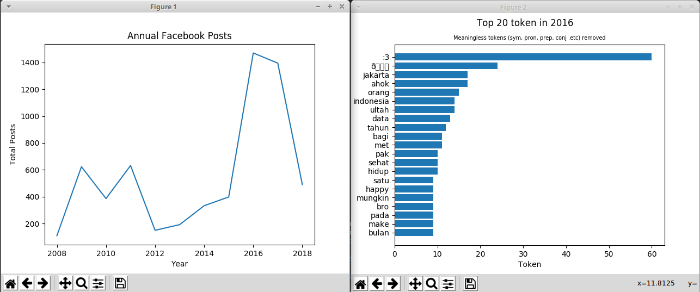

# fb-dump-analyzer

Facebook (json) dump analyzer. How to download your facebook data dump https://www.facebook.com/help/1701730696756992?helpref=hc_global_nav

Require Python 3.x

```
python fb-dump-analyzer.py -h
usage: fb-dump-analyzer.py [-h] input_dir

positional arguments:
  input_dir   Facebook dump (json) root directory

optional arguments:
  -h, --help  show this help message and exit
```

